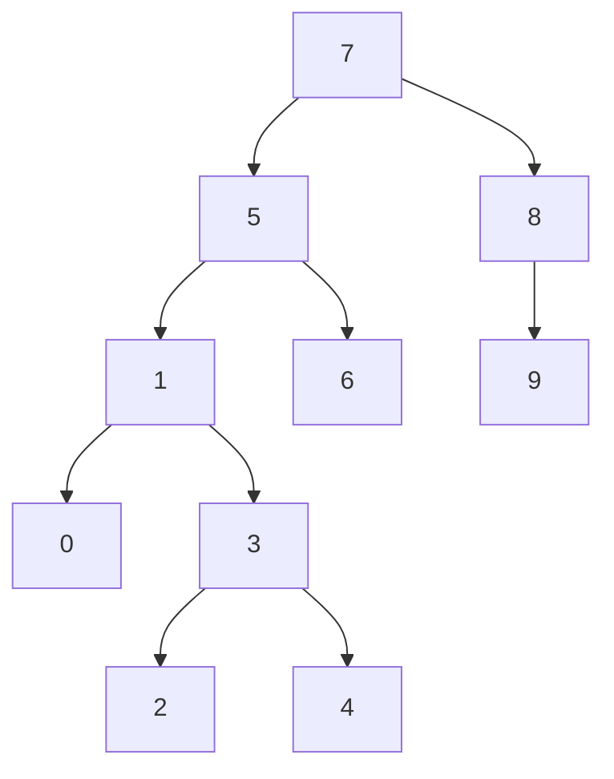

# Proje 3
## [7, 5, 1, 8, 3, 6, 0, 9, 4, 2] dizisinin Binary-Search-Tree aşamalarını yazınız.

### Örnek: root x'dir. root'un sağından y bulunur. Solunda z bulunur vb.

# Binary Tree
### Root = 7

5 sayısı 7'den küçük olduğu için 7'nin soluna   
1 sayısı 7'den küçük olduğu için 7'nin soluna, 1 sayısı 5'ten küçük olduğu için 5'in soluna   
8 sayısı 7'den büyük olduğu için 7'nin sağına   
3 sayısı 7'den küçük olduğu için 7'nin soluna, 3 sayısı 5'ten küçük olduğu için 5'in soluna, 3 sayısı 1'den büyük olduğu için 1'in sağına   
6 sayısı 7'den büyük olduğu için 7'nin soluna, 6 sayısı 5'ten büyük olduğu için 5'in sağına   
0 sayısı 7'den küçük olduğu için 7'nin soluna, 0 sayısı 5'ten küçük olduğu için 5'in soluna, 0 sayısı 1'den küçük olduğu için 1'in soluna   
9 sayısı 7'den büyük olduğu için 7'nin sağına, 9 sayısı 8'den büyük olduğu için 8'nin sağına   
4 sayısı 7'den küçük olduğu için 7'nin soluna, 4 sayısı 5'ten küçük olduğu için 5'in soluna, 4 sayısı 1'den büyük olduğu için 1'in sağına, 4 sayısı 3'ten büyük olduğu için 3'ün sağına   
2 sayısı 7'den küçük olduğu için 7'nin soluna, 2 sayısı 5'ten küçük olduğu için 5'in soluna, 2 sayısı 1'den büyük olduğu için 1'in sağına, 2 sayısı 3'ten küçük olduğu için 3'ün soluna   

